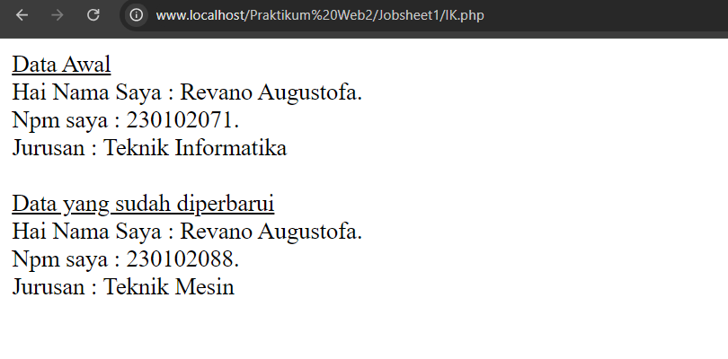

# Object Oriented Programing

__Pengertian OOP__
Pemrograman Berorientasi Objek (OOP), juga dikenal sebagai Pemrograman Berorientasi Objek (PBO) dalam bahasa Indonesia, adalah paradigma atau pendekatan pengembangan perangkat lunak atau program yang memiliki struktur berbasis objek serta fitur dan teknik yang dapat berinteraksi satu sama lain untuk mencapai tujuan tertentu.Prinsip-prinsip dasar OOP termasuk Encapsulation, Inheritance, Polymorphism, dan Abstraction yang memungkinkan pengembang untuk membuat kode yang lebih modular, fleksibel dan mudah dipelihara.

**Konsep Dasar OOP**
*Class dan Object:*
- Class: Blueprint atau template untuk menciptakan objek.
- Object: Instance dari class yang memiliki atribut (properties) dan perilaku(methods).


**Prinsip OOP**
- Encapsulation: Menyembunyikan detail implementasi dan hanya memberikan
akses melalui metode tertentu.

- Inheritance: Mewarisi sifat dan perilaku dari class lain.
- Polymorphism: Metode yang sama dapat memiliki implementasi berbeda
dalam class yang berbeda (Kemampuan untuk mengubah bentuk suatu objek).
- Abstraction: Menggambarkan sifat dan perilaku suatu objek tanpa menggambarkan detail implementasinya.


## Jobsheet 1

### <u> Instruksi Kerja </u>
1. Membuat Class dan Object
- Buat class Mahasiswa yang memiliki atribut nama, nim, dan jurusan.
- Buat metode tampilkanData() dalam class Mahasiswa.
- Instansiasi objek dari class Mahasiswa dan tampilkan data mahasiswa tersebut.
```php
<?php 
//Definisi kelas mahasiswa
class Mahasiswa {

    //Atribut atau Properti
    public $nama;
    public $nim;
    public $jurusan;

    ...
    ...

    //Method fungsi tampil data
    public function tampilkanData(){
         return "Hai Nama Saya : $this->nama.<br> Npm saya : $this->nim.<br> Jurusan : $this->jurusan ";
    }
}

//membuat objek dan menampilkannya
$tampil = new Mahasiswa ("Revano Augustofa",230102071,"Teknik Informatika");
echo $tampil->tampilkanData();
?>
```

2. Implementasi Constructor
- Tambahkan constructor pada kelas Mahasiswa yang akan menginisialisasi
atribut nama, nim, dan jurusan.
```php
<?php 
//Definisi kelas mahasiswa
class Mahasiswa {
    ...

    //constructor 
    public function __construct($nama, $nim, $jurusan){
        $this->nama = $nama;
        $this->nim = $nim;
        $this->jurusan = $jurusan;
    }
}
    ...
```
- Gunakan constructor ini untuk mengatur nilai awal dari atribut saat objek dibuat.
```php
<?php 
//Definisi kelas mahasiswa
class Mahasiswa {
   ...
    //constructor
    public function __construct($nama, $nim, $jurusan){
        $this->nama = $nama;
        $this->nim = $nim;
        $this->jurusan = $jurusan;
    }
    ...
    ...

    //Method fungsi tampil data
    public function tampilkanData(){
         return "Hai Nama Saya : $this->nama.<br> Npm saya : $this->nim.<br> Jurusan : $this->jurusan ";
    }
}

//membuat objek dan menampilkannya
$tampil = new Mahasiswa ("Revano Augustofa",230102071,"Teknik Informatika");
echo $tampil->tampilkanData();

```
3. Membuat Metode Tambahan
- Buat metode updateJurusan() dalam kelas Mahasiswa yang memungkinkan
perubahan jurusan.
```php
<?php 
//Definisi kelas mahasiswa
class Mahasiswa {

    ...
    ...
    ...

    //Method update jurusan
    public function updateJurusan($jurusan){
        $this->jurusan = $jurusan;
    }
}
    ...
    ...

```

- Gunakan metode ini untuk mengubah jurusan dari objek yang sudah dibuat.

```php
<?php 
//Definisi kelas mahasiswa
class Mahasiswa {
    ...
    ...
    ...

    //Method update jurusan
    public function updateJurusan($jurusan){
        $this->jurusan = $jurusan;
    }

}

//membuat objek dan menampilkannya
echo "<u>Data Awal</u><br>";
$tampil = new Mahasiswa ("Revano Augustofa",230102071,"Teknik Informatika");
    ...
echo "<br><br>";

echo "<u>Data yang sudah diperbarui</u><br>";
//mengupdate data jurusan menjadi teknik mesin
$tampil->updateJurusan("Teknik Mesin");


```

4. Penggunaan Atribut dan Metode
- Ubah nilai atribut nim dari objek Mahasiswa menggunakan metode setter.
```php
<?php 
//Definisi kelas mahasiswa
class Mahasiswa {
   ...
   ...
   ...
   ...
    //Method setNim
    public function setNim($nim){
        $this->nim = $nim;
    }
}

//membuat objek dan menampilkannya

//data awal
echo "<u>Data Awal</u><br>";
$tampil = new Mahasiswa ("Revano Augustofa",230102071,"Teknik Informatika");

echo "<br><br>";

//perbaharui isi data jurusan
echo "<u>Data yang sudah diperbarui</u><br>";
$tampil->updateJurusan("Teknik Mesin");

//mengubah nilai atribut nim
$tampil->setNim("230102088");


```
- Tampilkan data mahasiswa yang sudah diperbarui dengan memanggil metode
tampilkanData().

```php
<?php 
//Definisi kelas mahasiswa
class Mahasiswa {
   ...
   ...
   ...
   ...
   ...
}

//membuat objek dan menampilkannya
    ...
    ...
//menampilkan semua data awal
echo $tampil->tampilkanData();
echo "<br><br>";
    ...
    ...
//menampilkan semua data yang sudah di perbaharui
echo $tampil->tampilkanData();

```

_______

### <i>Full Code :</i>

jika dalam pengaplikasiannya akan tampak seperti ini.
```php
<?php 
//Definisi kelas mahasiswa
class Mahasiswa {
    //Atribut atau Properti
    public $nama;
    public $nim;
    public $jurusan;

    //constructor
    public function __construct($nama, $nim, $jurusan){
        $this->nama = $nama;
        $this->nim = $nim;
        $this->jurusan = $jurusan;
    }

    //Method fungsi tampil data
    public function tampilkanData(){
         return "Hai Nama Saya : $this->nama.<br> Npm saya : $this->nim.<br> Jurusan : $this->jurusan ";
    }

    //Method update jurusan
    public function updateJurusan($jurusan){
        $this->jurusan = $jurusan;
    }

    //Method setNim
    public function setNim($nim){
        $this->nim = $nim;
    }
}

//membuat objek dan menampilkannya

//data awal
echo "<u>Data Awal</u><br>";
$tampil = new Mahasiswa ("Revano Augustofa",230102071,"Teknik Informatika");
//menampilkan semua data awal
echo $tampil->tampilkanData();
echo "<br><br>";

//perbaharui isi data jurusan
echo "<u>Data yang sudah diperbarui</u><br>";
$tampil->updateJurusan("Teknik Mesin");
//mengubah nilai atribut nim
$tampil->setNim("230102088");
//menampilkan semua data yang sudah di perbaharui
echo $tampil->tampilkanData();

```
### <i>Hasil Output:</i>



## Jobsheet 2

## Jobsheet 3