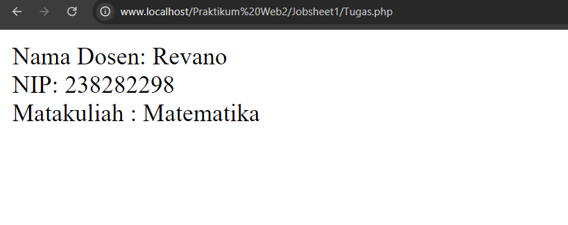

# Object Oriented Programing

__Pengertian OOP__
Pemrograman Berorientasi Objek (OOP), juga dikenal sebagai Pemrograman Berorientasi Objek (PBO) dalam bahasa Indonesia, adalah paradigma atau pendekatan pengembangan perangkat lunak atau program yang memiliki struktur berbasis objek serta fitur dan teknik yang dapat berinteraksi satu sama lain untuk mencapai tujuan tertentu.Prinsip-prinsip dasar OOP termasuk Encapsulation, Inheritance, Polymorphism, dan Abstraction yang memungkinkan pengembang untuk membuat kode yang lebih modular, fleksibel dan mudah dipelihara.

**Konsep Dasar OOP**
*Class dan Object:*
- Class: Blueprint atau template untuk menciptakan objek.
- Object: Instance dari class yang memiliki atribut (properties) dan perilaku(methods).


**Prinsip OOP**
- Encapsulation: Menyembunyikan detail implementasi dan hanya memberikan
akses melalui metode tertentu.

- Inheritance: Mewarisi sifat dan perilaku dari class lain.
- Polymorphism: Metode yang sama dapat memiliki implementasi berbeda
dalam class yang berbeda (Kemampuan untuk mengubah bentuk suatu objek).
- Abstraction: Menggambarkan sifat dan perilaku suatu objek tanpa menggambarkan detail implementasinya.


## Jobsheet 1 

### <u> TUGAS </u>
1. Implementasikan kelas Dosen dengan atribut nama, nip, dan mataKuliah.
2. Buat metode tampilkanDosen() untuk menampilkan informasi dosen.
3. Buat objek dari kelas Dosen, dan gunakan metode tampilkanDosen() untuk
menampilkan informasi tersebut.
4. Buat dokumentasi proyek dan unggah ke repository GitHub, menjelaskan proses
pembuatan kelas, penggunaan metode, dan hasil output.


**<u>1. Pembuatan Kelas </u>**
```php
<?php

//definisi kelas
class Dosen {
    //atribut atau properti
    public $nama; // membuat variabel nama
    public $nip; // membuat variabel nip
    public $mataKuliah; // membuat variabel mataKuliah
}
```
**<u>2. Pembuatan Metode </u>**
```php
class Dosen {
    ...

    //constructor
    public function __construct($nama,$nip,$mataKuliah){
        $this->nama = $nama;
        $this->nip = $nip;
        $this->mataKuliah = $mataKuliah;
    }
    //method fungsi tampil dosen
    public function tampilkanDosen(){
        return "Nama Dosen: $this->nama <br> NIP: $this->nip<br> Matakuliah : $this->mataKuliah";
    }
}

```
**<u>3. Pembuatan Objek </u>**
```php
<?php

//definisi kelas
class Dosen {
    ...
    ...
    ...
}

//membuat objek dan menampilkannya
$tampil =new Dosen("Revano","238282298","Matematika");
echo $tampil->tampilkanDosen();

```

### <i>Full Code :</i>

jika dalam pengaplikasiannya akan tampak seperti ini.
```php
<?php

//definisi kelas
class Dosen {
    //atribut atau properti
    public $nama;
    public $nip;
    public $mataKuliah;

    //constructor
    public function __construct($nama,$nip,$mataKuliah){
        $this->nama = $nama;
        $this->nip = $nip;
        $this->mataKuliah = $mataKuliah;
    }
    //method fungsi tampil dosen
    public function tampilkanDosen(){
        return "Nama Dosen: $this->nama <br> NIP: $this->nip<br> Matakuliah : $this->mataKuliah";
    }
}

//membuat objek dan menampilkannya
$tampil =new Dosen("Revano","238282298","Matematika");
echo $tampil->tampilkanDosen();
```
**<u>4. Output </u>**

## Jobsheet 2
**<u>1.Membuat Class dan Objek </u>**
```php
<?php 
//mendefinisikan class mahasiswa
class Mahasiswa{

    public $nama;
    public $nim;
    public $jurusan;

    //membuat construct 
    public function __construct($nama, $nim,$jurusan){
        $this->nama = $nama;
        $this->nim = $nim;
        $this->jurusan = $jurusan;
    }

    //method fungsi menampilkan data 
    public function tampilkanData(){
       return "Nama : $this->nama <br> NIM: $this->nim <br> Jurusan: $this->jurusan.";
    }
}
//instansiasi objek 
$mahasiswa1=new Mahasiswa("Revano Augustofa",230102071,"Teknik Informatika");
//menampilkan objek
echo $mahasiswa1->tampilkanData();
```

**<u>2.Encaptulation </u>**
```php
//mendefinisikan class mahasiswa
class Mahasiswa{

    private $nama="a";
    private $nim="3";
    private $jurusan="ff";

    //membuat construct 
    public function __construct($nama, $nim,$jurusan){
        $this->nama = $nama;
        $this->nim = $nim;
        $this->jurusan = $jurusan;
    }

    //method setNama
    public function setNama($nama){
        $this->nama=$nama;
    }

    //method setNim
    public function setNim($nim){
        $this->nim=$nim;
    }

    //method setJurusan
    public function setJurusan($jurusan){
        $this->jurusan=$jurusan;
    }

    //method getNama
    public function getNama(){
        return $this->nama;
    }

    //method getNim
    public function getNim(){
        return $this->nim;
    }

    //method getJurusan
    public function getJurusan(){
        return $this->jurusan;
    }
}
//instansiasi objek 
$mahasiswa1=new Mahasiswa("","","");
//menampilkan objek
$mahasiswa1->setNama("Arya Wiguna");
$mahasiswa1->setNim(230201038);
$mahasiswa1->setJurusan("Teknik Elektro");

echo "Nama :".$mahasiswa1->getNama()."<br>";
echo "NIM :".$mahasiswa1->getNim()."<br>";
echo "Jurusan :".$mahasiswa1->getJurusan()."<br>";

```
**<u>3.Inheritance </u>**
```php
<?php
class Pengguna {
    protected $nama;

    public function __construct($nama){
        $this->nama=$nama;
    }
    
    public function getNama(){
        return $this->nama;
    }
}

 class Dosen extends Pengguna{
    private $mataKuliah;

    public function __construct($nama,$mataKuliah){
        parent::__construct($nama);
        $this->mataKuliah=$mataKuliah;
    }

    public function getmatakuliah(){
        return $this->mataKuliah;
    }


}
echo "<hr>";
$mahasiswa2 = new Dosen ("Arya Abu Hurairah", "Matematika");
echo $mahasiswa2->getNama()."<br>";
echo $mahasiswa2->getmataKuliah();
```
**<u>4.Polymorphism </u>**
```php
<?php 
<?php 
//mendefinisikan class mahasiswa
class Mahasiswa{

    private $nama;
    private $nim;
    private $jurusan;

    //membuat construct 
    public function __construct($nama, $nim,$jurusan){
        $this->nama = $nama;
        $this->nim = $nim;
        $this->jurusan = $jurusan;
    }

    //method setNama
    public function setNama($nama){
        $this->nama=$nama;
    }

    //method setNim
    public function setNim($nim){
        $this->nim=$nim;
    }

    //method setJurusan
    public function setJurusan($jurusan){
        $this->jurusan=$jurusan;
    }

    //method getNama
    public function getNama(){
        return $this->nama;
    }

    //method getNim
    public function getNim(){
        return $this->nim;
    }

    //method getJurusan
    public function getJurusan(){
        return $this->jurusan;
    }

    public function aksesFitur(){
        echo "Melihat data Mahasiswa<br>";
    }
}
//instansiasi objek 
$mahasiswa1=new Mahasiswa("","","");
//menampilkan objek
$mahasiswa1->setNama("Arya Wiguna");
$mahasiswa1->setNim(230201038);
$mahasiswa1->setJurusan("Teknik Elektro");

echo "Nama :".$mahasiswa1->getNama()."<br>";
echo "NIM :".$mahasiswa1->getNim()."<br>";
echo "Jurusan :".$mahasiswa1->getJurusan()."<br>";

$mahasiswa1->aksesFitur();

class Pengguna {
    protected $nama;

    public function __construct($nama){
        $this->nama=$nama;
    }
    
    public function getNama(){
        return $this->nama;
    }
}

 class Dosen extends Pengguna{
    private $mataKuliah;

    public function __construct($nama,$mataKuliah){
        parent::__construct($nama);
        $this->mataKuliah=$mataKuliah;
    }

    public function getmatakuliah(){
        return $this->mataKuliah;
    }

    public function aksesFitur(){
        echo "Melihat data dosen<br>";
    }
}
echo "<hr>";
$mahasiswa2 = new Dosen ("Arya Abu Hurairah", "Matematika");
echo $mahasiswa2->getNama()."<br>";
echo $mahasiswa2->getmataKuliah();
$mahasiswa2->aksesFitur();

```
**<u>5.Abstraction </u>**
```php

```
## Jobsheet 3